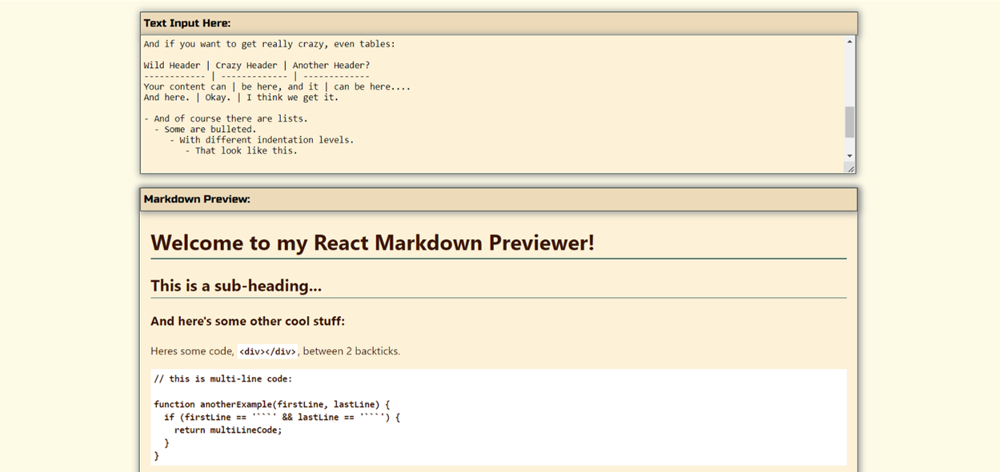

# Free Code Camp - Markdown Previewer

# The challenge

Your challenge is to build out Markdown Previewer.

Fulfill the user stories and get all of the tests to pass. Give it your own personal style.

You can use any mix of HTML, JavaScript, CSS, Bootstrap, SASS, React, Redux, and jQuery to complete this project. You should use a frontend framework (like React) because this section is about learning frontend frameworks. Additional technologies not listed above are not recommended and using them is at your own risk. Happy coding!

# My Solution

## Markdown Previewer project has been realised with React JS class component.

"Marked" have been used as a markdown converter and "DOMpurify" to sanitise the input.
I have used also the predefined placeholder text from the Codepen template.

### Here are some previews of the project

## Desktop view

## Laptop view

## Tablet view

## Mobile view

